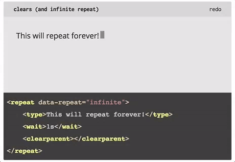

# tply
[View the live demo here!](https://ichub.github.io/tply/)



[Download the (10kb) release `tply.js` here](https://github.com/ichub/tply/releases/tag/1.0.1)

### What is tply? 
tply allows you to simulate text being typed out character by character. Here's a "hello world" example:

```html
<html>
    <head>
        <script src="the_path_to_tply.js"></script>
        <style>
            #source {
                display: none;
            }
        </style>
    </head>
    <body>
        <div id="source">
            <type>this text is typed out!</type>
        </div>
        <div id="destination">
        </div>
        
        <script>
            tply.animate(
                document.getElementById("source"),
                document.getElementById("destination"));
        </script>
    </body>
</html>
```

## Javascript Interface
tply renders the markup within the source element into the destination element. tply renders each element one by one,
in the order that they appear in the source element. You can create a template within html (make sure to hide it using 
css, or your content will show up twice), and then render it into a destination element.

```javascript
// this will use the contents of the element with the id 'source' as the template,
// and render it into the element with the id 'destination'.
tply.animate(
    document.getElementById("source"),
    document.getElementById("destination"));
```

Sometimes it is nice to be able to cancel an animation, either due to user input, or because the animation
would continue infinitely otherwise. tply returns a `Cancellation` object when you call `animate`, which allows you
to cancel an animation that is in progress.

```javascript
let cancellation = tply.animate(
    document.getElementById("source"),
    document.getElementById("destination"));

// cancel the animation and stop its execution after one second
setTimeout(
    function() {
        cancellation.cancel(function() {
            alert("cancelled!");
        });
    },
    1000);
```

In addition to pasing in the source and destination of the animation, you can pass in a 3rd, optional, argument,
with more configuration.

The configuration object follows this schema:
* `configuration` - an object with:
    * `types` - an array of:
        * `name` - a string with whatever you want the name of the type to be
        * `properties` - an object with:
            * key-value of attribute names and values
        * `styleClasses` - a string of whitespace-separated css class names to add to all elements with this type
        * `style` - a css string to put in the `style` attribute of all elements with this type
    * `processing` - an array of:
        * `tag` - a string with the tag name to match (eg. `div`)
        * `id` - a string with the id to match 
        * `pre` - a function that takes one parameter - an HTML Element - which tply will apply to all matching
        elements before they are inserted into the destination
        * `post` - same as `pre`, but applied after the element is inserted into the destination
    * `insertedClass` - class to add to all elements inserted throughout the animation. Default is `fadein`.
    * `shouldScrollDown` - whether or not to scroll to the bottom of the page after each inserted element.
        
#### Configuration Example
Here is an example `animate` invocation with a configuration object.
```javascript
tply.animate(
    document.getElementById("source"),
    document.getElementById("destination"),
    {
        types: [
            name: "robot-type",
            properties: {
                "data-char-interval": "0ms",
                "data-comma-interval": "0ms",
                "data-period-interval": "0ms",
                "data-word-interval": "100ms"
            },
            styleClasses: "robot-type",
            style: "font-family: monospace;"
        ],
        processing: [
            tag: "div",
            pre: function(element) {
                element.innerText += " haha"
            },
            post: function(element) {
                element.parentElement.style.backgroundColor = "red";
            }
        ]
    });
```

And here is the corresponding HTML:
```html
<div id="source">
    <type data-type="robot-type">
        this text will be typed out word-by-word rather than character-by-character!
    </type>
    <div>
        <!-- after this div is inserted, its parent will 
             be made to have a red background color -->
    </div>
</div>
<div id="destination">
</div>
```

## Cursor

All typed text is followed by a cursor, which is a css-styled div element. Here's the style I used to make blink (by 
default it just looks like a black square):

```css
@keyframes blink {
  0% {
    opacity: 1;
  }

  50% {
    opacity: 0.2;

  }

  100% {
    opacity: 1;
  }
}

.cursor {
  animation: blink 0.8s linear infinite alternate;
  background-color: rgb(84, 84, 84) !important;
}
```

## Custom Elements

In addition to being able to use any existing html element, you can also use one of these:

### `wait`
This element pauses the animation for a specified amount of time. Times can be specified in the format specified by the
`parse-duration` npm module, which can be found [here](https://www.npmjs.com/package/parse-duration). Here are some
example durations taken from that page:
```text
1ns  => 1 / 1e6 
1μs  => 1 / 1000 
1ms  => 1 
1s   => ms * 1000 
1m   => s * 60 
1h   => m * 60 
1d   => h * 24 
1w   => d * 7 
1y   => d * 365.25 
```

##### example
```html
<wait>100ms</wait>
```

### `type`
Text within this element is typed out character by character. Each character is a `span` with the `.character` class
applied to it. You can define the style of `.character` as you wish. For example, you could add an animation to fade
each character in, etc.

##### attributes
* `data-char-interval` - the time to pause after each character is typed out, in the same format as the `wait` tag.
* `data-period-interval` - the time to wait after a period (`.`) character.
* `data-comma-interval` - the time to wait after a comma.
* `data-end-interval` - the time to wait after the last character in the type element.
* `data-word-interval` - the time to wait after each word.

##### example
```html
<type>this text will be typed out</type>
```

### `repeat`
The stuff within a `repeat` element will be repeated a given amount of times.

##### attributes
* `data-repeat` - either a number or `'infinity'`, signifying the amount of times to repeat the content.

##### example
```html
<repeat data-repeat="5">
    <type>this will be repeated 5 times</type>
    <wait>500ms</wait>
</repeat>
```

### `clearparent`
Removes all children of its parent element.

##### example
``` html
<div id="remove_my_children">
    <type>this is some text</type>
    
    <wait>500ms</wait>
    <clearparent></clearparent>
<div>
```

### `clearall`
Removes all children of the root animation source.

##### example
```html
<div>
    wow
    <div>
        nice
        <span><clearall></clearall></span>
    </div>
</div>
```

### `delete`
Delete's the last `n` characters written by tply.

##### attributes
* `data-chars` - the amount of characters to delete
* `data-ignore-whitespace` - booleanm whether or not to ignore whitespace characters in counting (whitespace characters
will still be ignored.

##### example
```html
<type>wow</type>
<delete data-chars="3"></delete>
```

## Contributing

### Development
Before you can start developing, install `gulp` and `tsd` globally, and then install the project's dependencies:

```bash
cd path/to/tply
sudo npm install -g gulp tsd
npm install
tsd install
```

These are the tasks in the gulpfile which you can use for development

##### `gulp sass`
Builds the style for the demo page.

##### `gulp ts`
Builds the TypeScript into JavaScript. Converts the javascript from ES2015 into the current standard Javascript. Bundles up npm dependencies. If the production flag is specified, minfies the output as well.

##### `gulp watch`
Builds the TypeScript and Sass, watches for changes and recompiles when a change is detected.

##### `gulp serve`
Serves `index.html` using a livereload server, and watches source files for changes.

##### `gulp lint`
Lints the TypeScript.

#### Contribution Guidelines

* Don't introduce linting or TypeScript compilation errors.
* If you change the behavior or something, make sure it reflects in the readme.
* Make sure the stuff in `/css` and `/dist` are up to date with code in `/src` and `/sass`